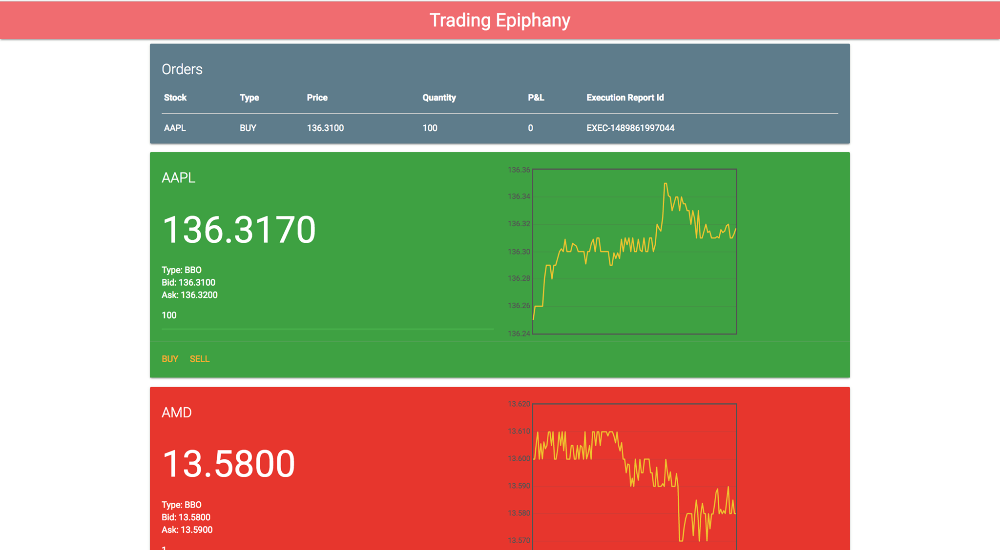
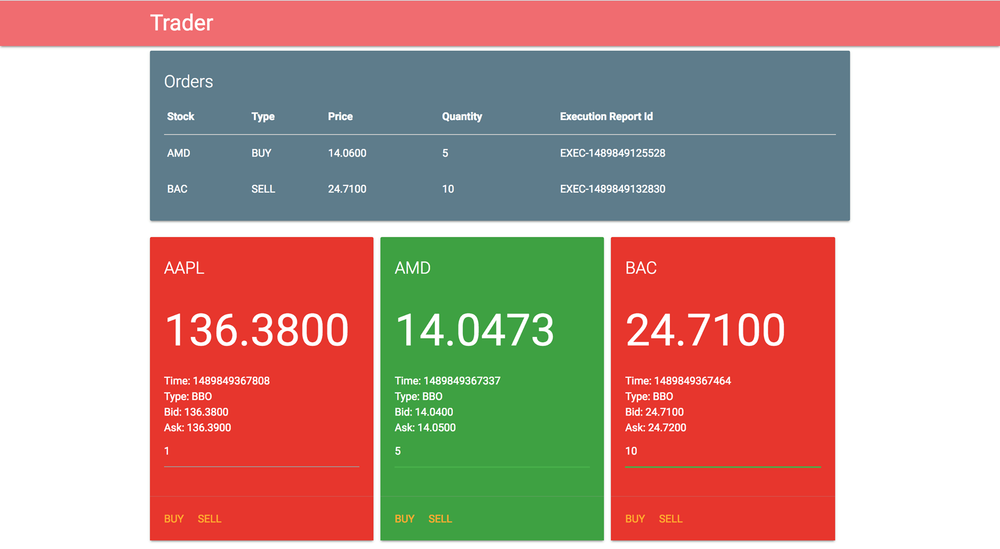

# Trading Epiphany

This was the winner of the Systematica Codeathon 2017.
The goal was to build a **real time trading platform**.

We were provided with a mock server API which streamed
real time market data  (Last Trade and Best Bid Offer messages)
and a trade execution facility to submit orders and
received order update messages. Full specs available
[here](codeathon_specs.pdf).

## Final Platform

We used React to build the platform and were able to
show tiles for each stock. The tiles changed color
based on the change in price for each stock. We also
had a real time graph in each tile which showed the
change in price for the stock.

Each tile also allowed you to buy or sell the
quantity of stock you wanted. Once the order is placed
it shows up in the orders tile. Here the order updates in
real time by showing the quantity traded and the current P&L.

